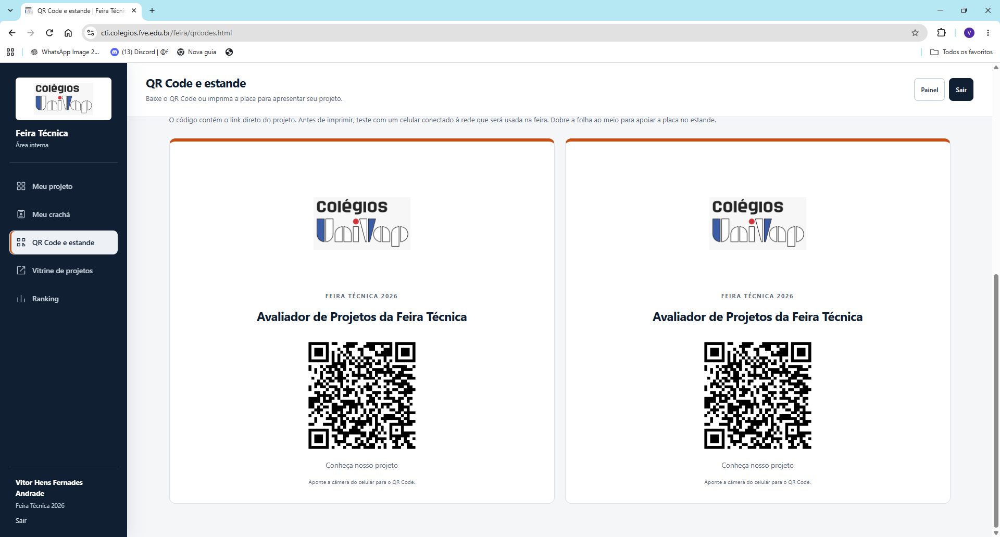

# Sistema de Avaliação da Feira Técnica

> Plataforma web utilizada na **Univap Centro** para organizar e apresentar os projetos da Feira Técnica.

O sistema reúne, em um só lugar, o catálogo dos trabalhos, a apresentação das equipes, as avaliações da banca e a votação dos visitantes. Também oferece ferramentas para preparar a participação na feira, como crachás e QR Codes que levam diretamente à página de cada projeto.

Desenvolvido como projeto acadêmico de Informática, conecta o trabalho dos alunos à experiência de professores, visitantes e organizadores. **Foi utilizado na escola Univap Centro e continua em evolução.**

## Visão geral

| Item | Descrição |
| --- | --- |
| Contexto | Feira Técnica dos Colégios Univap — unidade Centro |
| Objetivo | Centralizar a apresentação, a organização e a avaliação dos projetos |
| Público | Alunos, professores avaliadores, visitantes e administradores |
| Aplicação | Sistema web com interface responsiva e áreas de acesso por perfil |
| Tecnologias principais | Node.js, Express, MongoDB, JavaScript, HTML e CSS |
| Estado | Utilizado na escola; desenvolvimento e melhorias contínuas |

## Telas do sistema

As capturas abaixo mostram o projeto no ambiente da Univap Centro. Foram organizadas por funcionalidade para apresentar o fluxo de uso.

### 1. Vitrine de projetos

O catálogo público apresenta os trabalhos em cartões com imagem, curso, etapa de desenvolvimento, resumo e acesso à página do projeto. A busca e os filtros ajudam o visitante a encontrar os trabalhos de interesse.


### 2. Área do aluno

O painel reúne as ferramentas da equipe: edição da página pública, acompanhamento do preenchimento e acesso ao QR Code do projeto. A apresentação é organizada em etapas para explicar a ideia e o que foi construído.


### 3. Edição da apresentação

Os alunos autorizados podem descrever o problema, os objetivos, a solução, o diferencial, as tecnologias e os materiais utilizados, além de incluir fotos e links. O painel também permite consultar a equipe e salvar as informações da página pública.


### 4. Crachás dos participantes

A tela permite selecionar os integrantes, definir a função, adicionar uma foto e visualizar os crachás antes da impressão. É possível preparar dois crachás com margens de recorte em uma folha A4.


### 5. QR Code e placa do estande

Cada projeto possui um QR Code que direciona à sua apresentação pública. A placa pode ser impressa para o estande, facilitando o acesso pelo celular durante a visita.



## Como o sistema funciona

1. **A organização prepara a feira:** cadastra ou importa projetos, participantes e avaliadores, além de configurar o período da votação.
2. **As equipes apresentam seus trabalhos:** completam a página pública com resumo, objetivos, solução, tecnologias, fotos e links.
3. **Os participantes preparam os materiais:** geram os crachás e os QR Codes que serão utilizados nos estandes.
4. **Os visitantes conhecem os projetos:** navegam pelo catálogo ou acessam as apresentações pelos QR Codes e podem votar no período autorizado.
5. **A banca avalia os trabalhos:** registra avaliações, enquanto o sistema disponibiliza histórico e rankings.

## Perfis de acesso

| Perfil | Principais recursos |
| --- | --- |
| Visitante | Consultar o catálogo e as páginas públicas; votar quando a votação estiver liberada |
| Aluno | Editar a apresentação da própria equipe, adicionar fotos e preparar crachás e QR Codes |
| Professor avaliador | Acessar a área de avaliação, registrar avaliações e consultar os recursos da banca |
| Administrador | Gerenciar cadastros, importações, projetos e configurações da votação |

Os acessos de aluno, avaliador e administrador são separados e protegidos por autenticação e validação de permissões.

## Funcionalidades

- **Apresentação dos projetos:** catálogo com busca e filtros, páginas públicas e edição pelas equipes autorizadas.
- **Avaliação e resultados:** avaliações da banca, histórico e ranking; votação de visitantes com período configurável e códigos opcionais.
- **Materiais da feira:** geração de QR Codes, placas dos estandes e crachás.
- **Organização:** cadastro e importação de professores por CSV, além de importação privada de projetos e participantes.
- **Experiência de uso:** interface responsiva para computador e celular.
- **Controle de acesso:** proteção de rotas, cookies de sessão, limite de tentativas de login e validações.

## Tecnologias

| Camada | Tecnologias |
| --- | --- |
| Interface | HTML, CSS e JavaScript |
| Servidor e API | Node.js e Express |
| Banco de dados | MongoDB |
| Autenticação | JWT, bcrypt e cookies `HttpOnly` |
| QR Codes | Biblioteca `qrcode` |
| Logs | Winston |
| Desenvolvimento | Nodemon e testes nativos do Node.js |

## Organização do repositório

| Caminho | Responsabilidade |
| --- | --- |
| `src/api/controllers/` | Tratamento das requisições da API |
| `src/api/dao/` e `src/api/database/` | Persistência, conexão e rotinas do banco |
| `src/api/models/` | Modelos e regras dos dados |
| `src/api/routes/` e `src/api/middleware/` | Rotas, autenticação e validações |
| `src/api/services/` | Serviços da aplicação |
| `src/public/` | Páginas, estilos, scripts e imagens da interface |
| `tests/` | Testes automatizados |
| `tools/` | Ferramentas de importação, verificação e operação |
| `docs/` | Documentação e capturas das telas |
| `nginx/conf/` | Configuração de publicação com Nginx |
| `Server.js` e `index.js` | Configuração e inicialização do servidor |

## Executar localmente

### Requisitos

- Node.js 20 ou superior, conforme o `package.json`;
- MongoDB em execução;
- npm para instalar as dependências.

### Instalação

```bash
git clone https://github.com/VitorHens/sistema-avaliacao-feira-tecnica.git
cd sistema-avaliacao-feira-tecnica
npm ci
```

Antes de iniciar, configure as variáveis no ambiente do processo conforme [`.env.example`](.env.example) e [Configuração e dados](docs/CONFIGURACAO.md). O projeto não carrega o arquivo `.env` automaticamente.

```bash
npm start
```

Com a configuração padrão, abra **http://localhost:3000/feira/**.

Para desenvolvimento com reinício automático:

```bash
npm run dev
```

## Preparar os dados da feira

A planilha oficial, as exportações de participantes, as credenciais e os arquivos gerados em `data/` devem permanecer fora do repositório público. O diretório `data/` é ignorado pelo Git.

Para gerar localmente a carga de projetos a partir do CSV oficial:

```powershell
node tools/incorporar-projetos.cjs "C:\caminho\cadastro-feira.csv"
```

O comando cria `data/projetos-feira-2026.json`. Ao iniciar, a aplicação importa os projetos sem substituir apresentações já editadas. Outro caminho pode ser definido com `PROJECTS_DATA_FILE`.

Consulte [Configuração e dados](docs/CONFIGURACAO.md) para preparar contas, conferir pendências e distribuir os acessos.

## Testes e verificações

```bash
npm test
node tools/check-frontend.cjs
npm audit --omit=dev
```

**Registro da revisão de 25 de setembro de 2026:** 40 testes passaram, 32 scripts do front-end foram validados e a auditoria encontrou 0 vulnerabilidades conhecidas nas dependências de produção. Esse resultado é histórico; execute os comandos novamente para verificar a versão e as dependências do seu ambiente.

## Implantação e segurança

A aplicação aceita publicação sob o prefixo `/feira/` e inclui uma configuração mínima de Nginx. Para implantar em outro ambiente, configure HTTPS, segredos persistentes, URL pública dos QR Codes e backup do MongoDB.

- `.env`, cargas privadas, logs, backups e credenciais não são versionados.
- Os segredos JWT e da votação devem ter pelo menos 32 caracteres.
- Os cookies de sessão usam `HttpOnly` e `SameSite=Lax`.
- As senhas são armazenadas com bcrypt.
- Contas de teste só podem ser ativadas fora de produção.
- Respostas internas não expõem pilhas de erro ao usuário.
- Senhas iniciais de alunos e avaliadores são temporárias e devem ser trocadas no primeiro acesso.

| Documento | Conteúdo |
| --- | --- |
| [Configuração e dados](docs/CONFIGURACAO.md) | Variáveis de ambiente, importação e preparação dos acessos |
| [Implantação](docs/IMPLANTACAO.md) | Publicação e configuração do servidor |
| [Segurança](SECURITY.md) | Cuidados com dados, senhas e operação |

## Melhorias futuras

- ampliar os testes dos fluxos completos com MongoDB;
- validar acesso aos QR Codes, impressão e navegação em diferentes dispositivos;
- acompanhar os testes automáticos no GitHub Actions;
- testar periodicamente a restauração dos backups;
- aprimorar a experiência a partir do uso na escola.

## Créditos

Projeto acadêmico desenvolvido a partir da base do professor **Hélio Lourenço Esperidião Ferreira**, com organização e evolução no repositório de **Vitor Hens**.

**Contexto de uso:** escola Univap Centro, Feira Técnica dos Colégios Univap.
